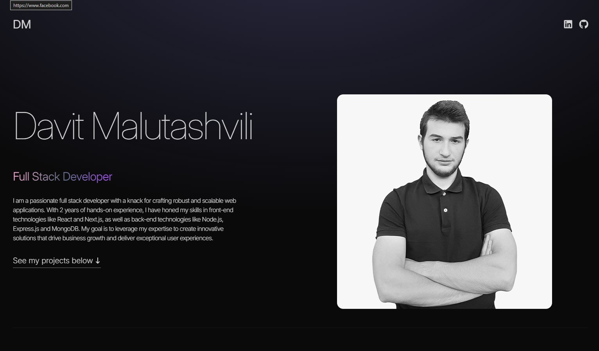

  <h1 style="position:relative; top: -6px" >Portfolio Website</h1>

---

### Screenshot

This is my portfolio website where employers can find out all about me.

General information, necessary links, work experience, completed projects, learned technologies and contact information - this is all you can see about me.

#

### Table of Contents

- [Prerequisites](#prerequisites)
- [Tech Stack](#tech-stack)

### Prerequisites

- _Node JS @20.X and up_
- _npm @10 and up_

#

### Tech Stack

- [React] - Front-end framework
- [Tailwind CSS] - CSS framework for styling
- [Framer Motion] - Animation library

